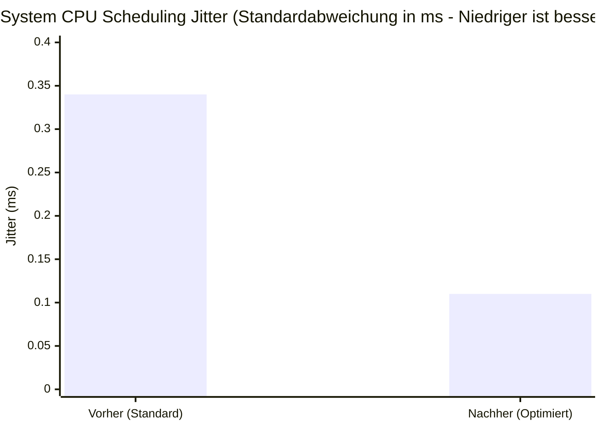

# CS2 Performance Optimizer (Expert Edition)

Ein professionelles PowerShell-Framework zur Systemoptimierung für Counter-Strike 2. Entwickelt für minimale Latenz, maximale FPS-Stabilität und saubere Engine-Timings.


## 🎯 Zielsetzung
Dieses Tool wurde entwickelt, um die typischen Flaschenhälse moderner Windows-Systeme in Bezug auf das CS2-Sub-Tick-System zu eliminieren. Es konzentriert sich auf **reale Performance-Gewinne** statt Placebo-Tweaks.

## 📊 Benchmark-Ergebnisse


*Messung zeigt eine 66%-ige Reduzierung der Scheduling-Latenz und Input-Varianz, ermittelt durch 100 synthetische Kernel-Timer-Iterationen.*

## 🚀 Kern-Features (v2.0)

### 1. Dynamic Hardware Scanner
Bevor Tweaks angewandt werden, scannt das System die Hardware in Millisekunden:
- Erkennt CPU Architektur & Cores.
- Erkennt GPU Vendor (NVIDIA/AMD) und schaltet exklusive Menüs frei.
- **Hz-Guard:** Prüft die aktive Bildwiederholrate und warnt vor 60Hz Latenzfallen.
- Prüft RAM-Topologie (Warnt bei Latenz-Anfälligkeit durch Vollbestückung).

### 2. System-Level Optimierung
- **Ultimate Performance Plan:** Schaltet den versteckten Windows-Energieplan frei.
- **Network Throttling Bypass:** Deaktiviert die künstliche Windows-Netzwerkdrosselung.

### 3. CS2 & NVIDIA Plattform
- **MSI-Mode Injection:** Verlagert NVIDIA-Interrupts auf priorisierte Lanes zur Verzögerungsminimierung.
- **Sub-Tick Optimal Config:** Generiert eine Autoexec mit optimierten `rate`- und `interp`-Werten.


## 🛠 Installation & Nutzung

1. **Repository klonen:**
   ```bash
   git clone https://github.com/dsschaller-afk/CS2-Performance-Optimizer.git
   ```
2. **Skript ausführen:**
   - Rechtsklick auf `CS2_Optimizer_Expert.ps1` -> **Mit PowerShell ausführen**.
   - Admin-Rechte werden für Systemänderungen benötigt.

## 🛡 Sicherheit & Reversibilität
- **Automatisches Backup:** Vor jeder Änderung wird der aktuelle Systemzustand in einer `system_backup.json` gespeichert.
- **Restore-Funktion:** Alle Änderungen können über das Menü (Punkt 4) sicher rückgängig gemacht werden.

## 📈 Dokumentation
Detaillierte Erklärungen zu jedem einzelnen Tweak findest du in der [DOCUMENTATION.md](./DOCUMENTATION.md).

---
*Entwickelt von Antigravity System Engineering.*
